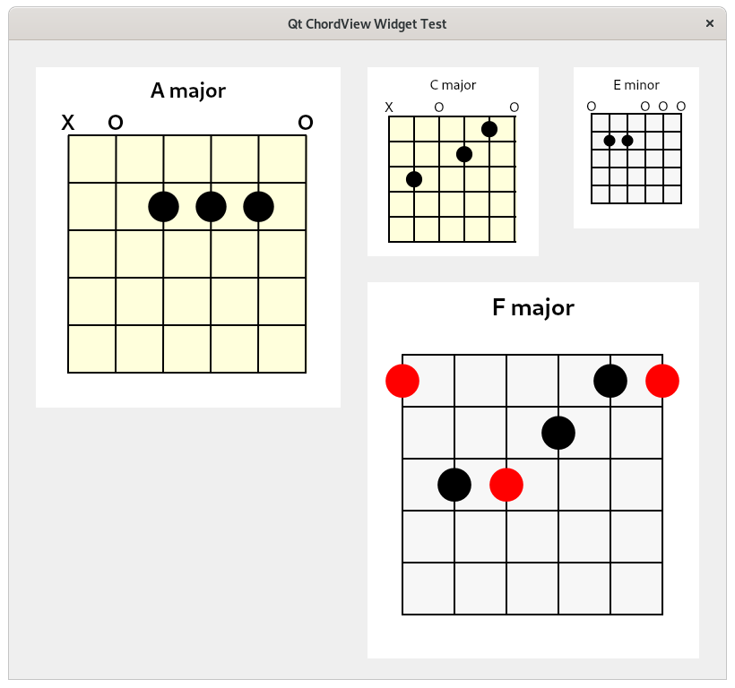

# qt-chordview
A custom guitar chord box widget for Qt

It's a work in progress and pretty basic at the moment...

## TODO
Lots of stuff...

- [X] Simple chord name label
- [ ] Chord name formatting (e.g use subscript font for maj, min, 7, sus2, sus4 )
- [X] Open string marker
- [X] Muted string marker
- [ ] Draw fretboard nut
- [ ] Fret number
- [ ] Finger labels
- [ ] String names/numbers
- [ ] Note names

